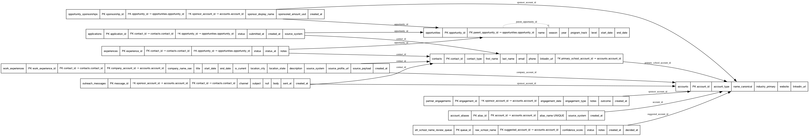
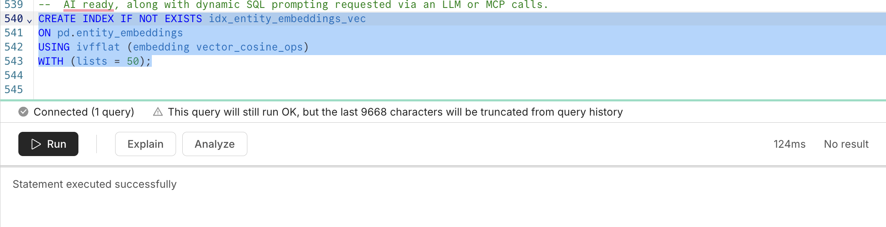
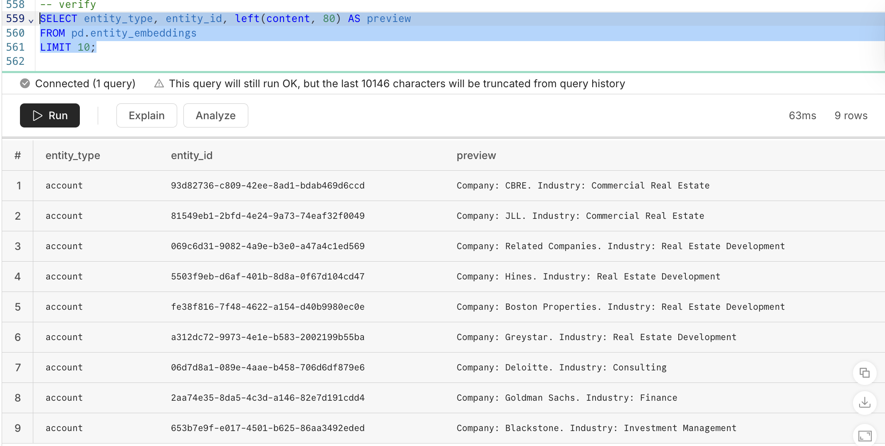
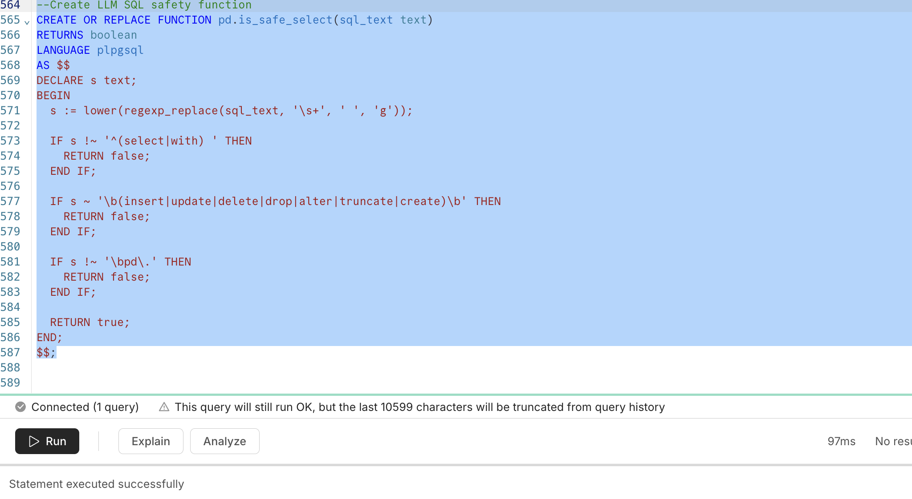
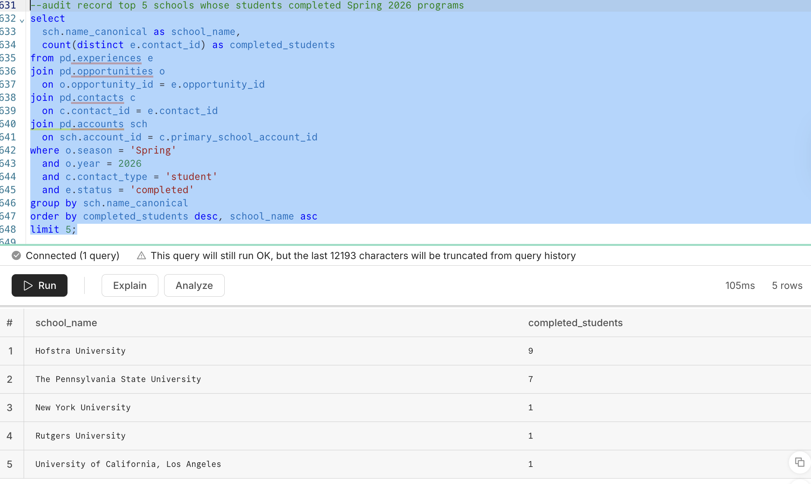

# Reporting Artifacts

This folder stores generated Markdown and CSV artifacts from the pipeline.

- `null_profile.md`: Per-table, per-column null counts and percentages.
- `null_profile.csv`: CSV version of the null profile for spreadsheet analysis.
- `quality_checks.md`: PASS/FAIL summary including unacceptable nulls (PKs/FKs), FK orphan counts, and duplicate logical keys (applications).
- `eda_report.md`: Top-level Markdown summaries for distributions and totals.
- `eda_csv/`: Full CSV outputs corresponding to EDA summaries (contact types, application statuses, experience statuses, top schools by applicants, placements by industry, sponsor funding totals).
- `data_export.xlsx`: Full table exports for convenience (stored as Excel).

## Schema Diagram

The current database schema (tables and key relationships):

## AI Ready & LLM Proofs

These screenshots demonstrate the AI-ready components and guarded LLM-driven SQL.

- AI readiness:
	- 
	- 
	- 
- LLM + SQL guardrails:
	- 
	- 

Context: The project uses pgvector embeddings and a safe SQL layer that restricts dynamic queries to `SELECT` on `pd.v_*` views with enforced `LIMIT`. See the main README for details and links to code.

Usage:
- Share `quality_checks.md` with stakeholders to confirm the data meets the Nullability Contract.
- Use `null_profile.csv` for targeted cleanup work or triage.
- Attach `eda_report.md` and `eda_csv/` when preparing insights; the Markdown is readable, CSVs are wide tables.
- `data_export.xlsx` is provided for non-technical review; the source of truth remains the database.
